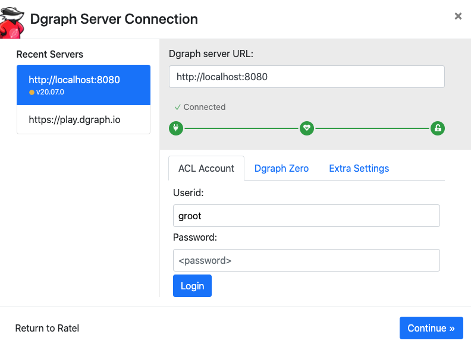

# How to run Quartermaster on a Kubernetes cluster

<!-- TODO Introduction -->

1. Launch the DGraph database:
    ```bash
    kubectl apply -k dgraph
    ```

1. Specify the Maven repository to be cloned in [`qmstr/repo-url.yaml`](qmstr/repo-url.yaml).

1. Launch Quartermaster:
    ```bash
    kubectl apply -k qmstr
    ```

1. Wait for the build and analysis phases to be over:
    ```bash
    kubectl logs --follow $(kubectl get pods --selector job-name=qmstr -o=name) qmstr-client
    ```

1. Forward two local ports to the following two ports on the DGraph Pod:
    ```bash
    kubectl port-forward statefulset/dgraph 8000:8000
    ```
    ```bash
    kubectl port-forward statefulset/dgraph 8080:8080
    ```

1. Open [localhost:8000/?latest](http://localhost:8000/?latest) in your browser.

1. Click on "Continue":
    <p align="center">
        
    </p>

1. Navigate to the "Console" page.

1. You should now be able to query the database:  
    ```graphql
    {
        PackageNodes(func: has(packageNodeType)) @recurse(loop: true, depth: 3) {
            uid
            name
            version
            packageNodeType
            targets
            additionalInfo
            buildConfig
            diagnosticInfo
            timestamp
        }
    
        FileNodes(func: has(fileNodeType)) @recurse(loop: true, depth: 3) {
            uid
            fileNodeType
            path
            name
            fileData
            timestamp
            derivedFrom
            dependencies
        }
    
        FileDataNodes(func: has(fileDataNodeType)) @recurse(loop: true, depth: 3) {
            uid
            fileDataNodeType
            hash
            additionalInfo
            diagnosticInfo
        }
    
        InfoNodes(func: has(infoNodeType)) @recurse(loop: true, depth: 3) {
            uid
            infoNodeType
            type
            confidenceScore
            analyzer
            dataNodes
            timestamp
        }
    
        Analyzers(func: has(analyzerNodeType)) @recurse(loop: true, depth: 3) {
            uid
            name
            analyzerNodeType
            trustLevel
            pathSub
            old
            new
        }
    
        DataNodes(func: has(dataNodeType)) @recurse(loop: true, depth: 3) {
            uid
            dataNodeType
            type
            data
            timestamp
        }
    }
    ```

1. The generated graph should look something like this:
    <p align="center">
        
    </p>
    Build graph is on the left, having (Java) package node as central ones.
    License and compliance information is on the right, having analyzer nodes (e.g., scancode) as central ones. 
