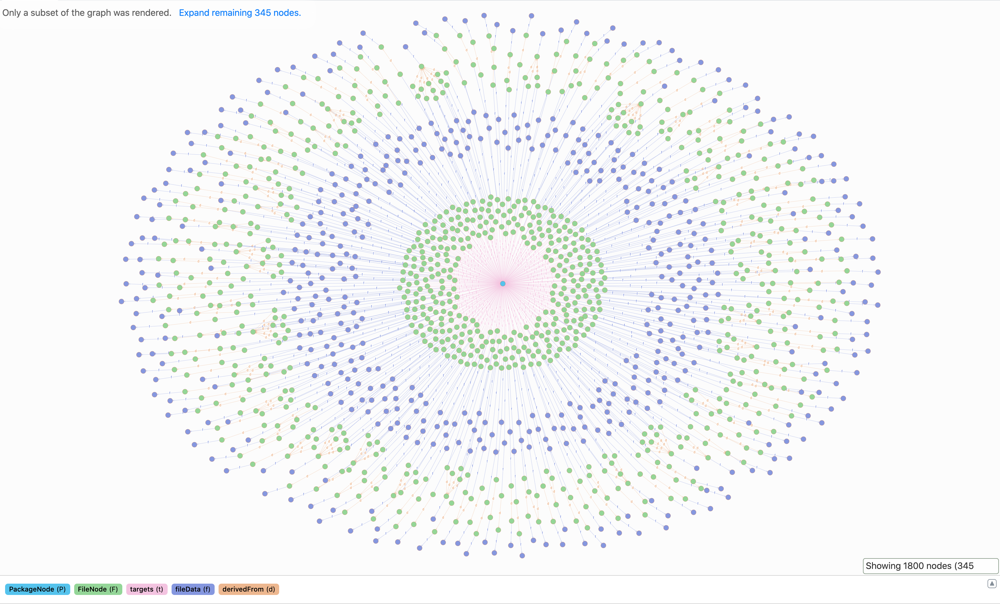

# How to run Quartermaster on a Kubernetes cluster

<!-- TODO Introduction -->

1. Launch the DGraph database:
    ```bash
    kubectl apply -k dgraph
    ```

1. Launch Quartermaster:
    ```bash
    kubectl apply -k qmstr
    ```

1. Wait for the building process to be over:
    ```bash
    kubectl logs --follow $(kubectl get pods --selector job-name=qmstr -o=name) qmstr-client
    ```

1. Forward two local ports to the following two ports on the DGraph Pod:
    ```bash
    kubectl port-forward dgraph-0 8000:8000
    ```
    ```bash
    kubectl port-forward dgraph-0 8080:8080
    ```

1. Open [localhost:8000/?latest](http://localhost:8000/?latest) in your browser.

1. Click on "Continue":
    <p align="center">
        
    </p>

1. Navigate to the "Console" page.

1. You should now be able to query the database:
    ```graphql
    {
        # *.class files
        PackageNode(func: has(packageNodeType)) {
            uid
            name
            version
            buildConfig
            timestamp
            packageNodeType
            targets { # a.k.a. "target FileNodes"
                uid
                path
                name
                timestamp
                fileNodeType
            }
        }

        # FileNodes of compiled outer and inner [anonymous] classes
        FileNode(func: has(fileNodeType)) {
            uid
            fileNodeType
            path
            name
            timestamp
            fileData { # points to "target FileNodes"
                uid
                fileDataNodeType
                hash
            }
            derivedFrom { # *.java files
                uid
                fileNodeType
                path
                name
                timestamp
                fileData { # outer FileData nodes
                    uid
                    fileDataNodeType
                    hash
                }
            }
        }
    }
    ```

1. The generated Build Graph should look something like this:
    <p align="center">
        
    </p>
